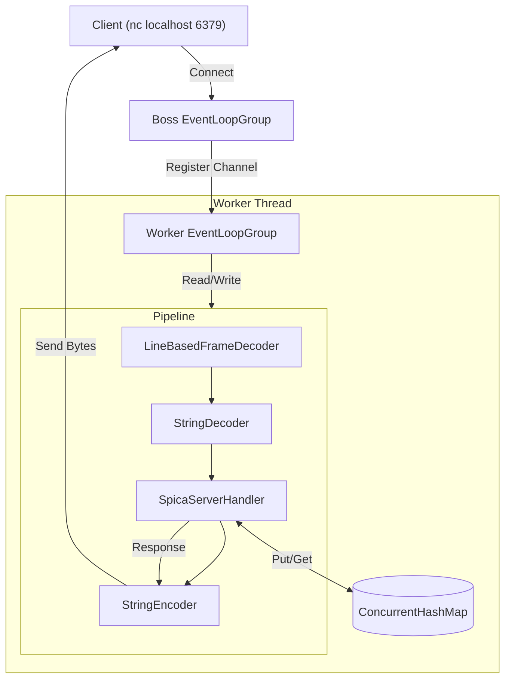
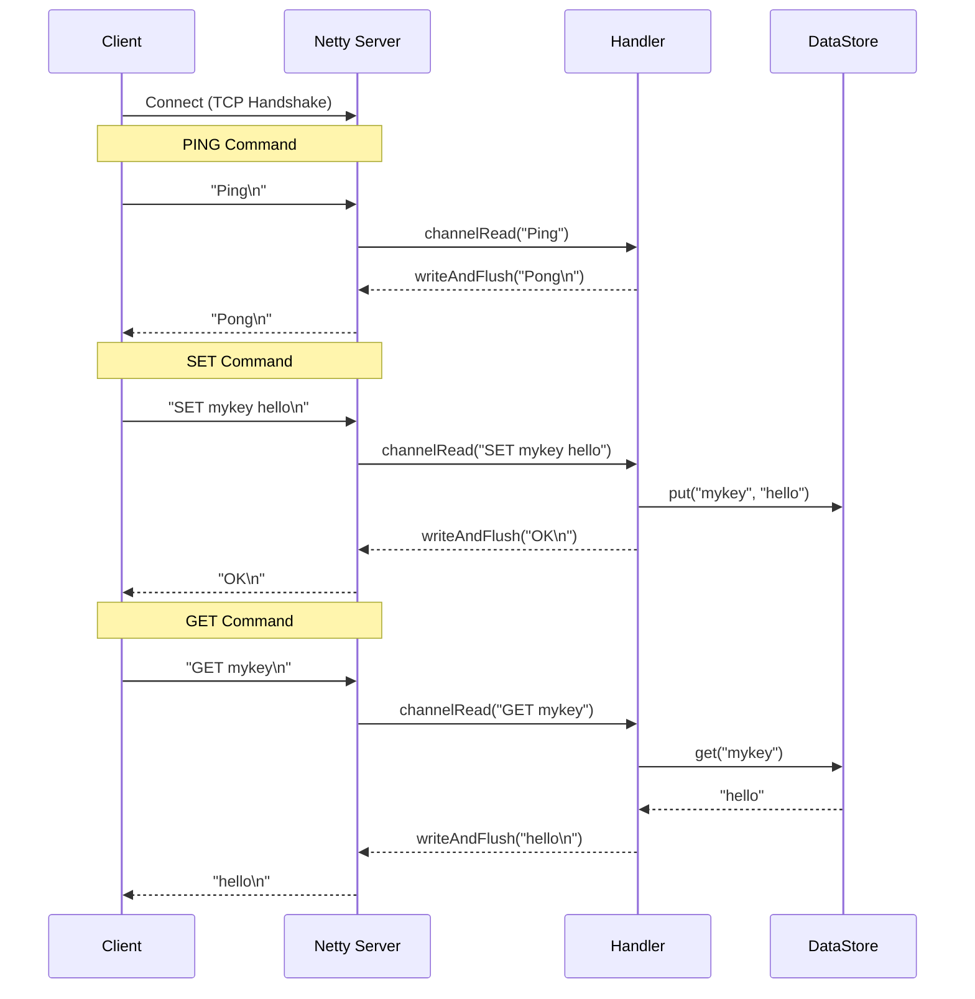

# SPiCa Server

**Netty** 프레임워크를 사용하여 구현된 간단한 **In-Memory Key-Value Store**.
클라이언트는 TCP를 통해 접속하여 `PING`, `SET`, `GET` 명령어를 사용할 수 있습니다.

## Features

*   **PING**: 서버 상태 확인 (`PONG` 응답)
*   **SET**: 키-값 저장 (`SET key value`)
*   **GET**: 키로 값 조회 (`GET key`)
*   **In-Memory Storage**: `ConcurrentHashMap`을 사용한 스레드 안전한 데이터 저장

## Architecture

Netty의 비동기 이벤트 기반 아키텍처를 따릅니다.

### Core Components

1.  **EventLoopGroup**:
    *   **Boss Group**: 클라이언트 연결 수락
    *   **Worker Group**: I/O 처리
2.  **ChannelPipeline**:
    *   `LineBasedFrameDecoder`: 패킷 분리
    *   `StringDecoder`: 바이트를 문자열로 변환
    *   `StringEncoder`: 문자열을 바이트로 변환
    *   `Handler`: 명령어 파싱 및 실행

### Data Flow

1.  **Request**: Client -> Boss Group -> Worker Group -> Pipeline -> Handler
2.  **Processing**: Handler에서 명령어 파싱 (`SET`, `GET`, `PING`) -> `ConcurrentHashMap` 조회/저장
3.  **Response**: Handler -> Pipeline (Encoder) -> Client

## Diagrams

### Server Structure



### Sequence Diagram



## How to Run

### Prerequisites
- Java 24 or higher
- Gradle

### Run Server
```bash
./gradlew run
```
or
```bash
gradle run
```

### Client Test (netcat)

터미널을 열고 다음 명령어들을 입력하여 테스트할 수 있습니다.

**1. Ping Test**
```bash
echo "Ping" | nc localhost 6379
# 응답: Pong
```

**2. Set Test**
```bash
echo "SET mykey myvalue" | nc localhost 6379
# 응답: OK
```

**3. Get Test**
```bash
echo "GET mykey" | nc localhost 6379
# 응답: myvalue
```
