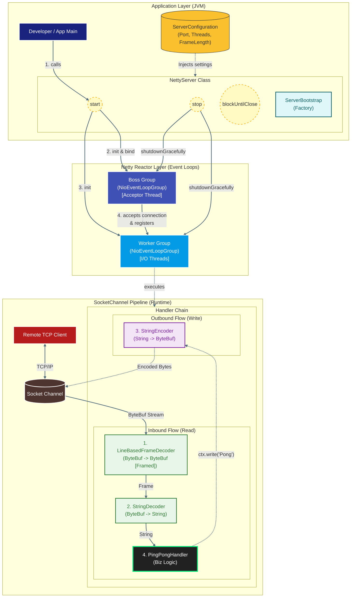
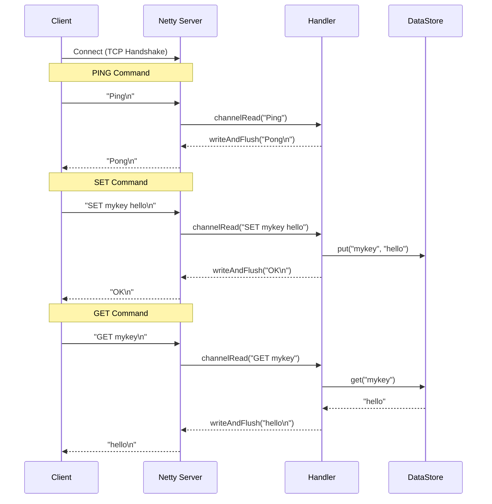

# SPiCa Server

SPiCa는 **Netty** 프레임워크를 사용하여 구현된 간단한 **In-Memory Key-Value Store Server**입니다. <br/>
클라이언트는 TCP를 통해 접속하여 `PING`, `SET`, `GET`.. 명령어를 사용할 수 있습니다.

## Features

*   **PING**: 서버 상태 확인 (`PONG` 응답)
*   **SET**: 키-값 저장 (`SET key value`)
*   **GET**: 키로 값 조회 (`GET key`)
*   **In-Memory Storage**: `ConcurrentHashMap`을 사용한 Thread-safe한 데이터 저장

## Architecture (Component Specifications)

### Thread Model (Event Loop Groups)
시스템의 스레드 모델은 역할에 따라 물리적으로 격리된 두 개의 `EventLoopGroup`으로 구성됩니다.

* **Acceptor Group (Boss):**
    * 단일 스레드(혹은 설정된 소수)로 구성되며 `OP_ACCEPT` 이벤트만을 전담합니다.
    * TCP 3-way Handshake를 완료한 `SocketChannel`을 생성하고, 즉시 Worker Group의 Selector에 등록(Register)하여 병목을 제거합니다.
* **I/O Processor Group (Worker):**
    * CPU 코어 수에 비례하여 할당된 스레드 풀입니다.
    * 할당된 Channel의 모든 `OP_READ`, `OP_WRITE` 이벤트를 **Single-Threaded Event Loop** 내에서 순차 처리하여, 불필요한 동기화(Lock) 비용을 제거합니다(Lock-free Architecture).

### Channel Pipeline (Responsibility Chain)
데이터 처리 로직은 **Interceptor Filter Pattern**의 변형인 `ChannelPipeline`을 통해 계층화되어 있습니다. 각 핸들러는 단일 책임 원칙(SRP)에 따라 엄격히 분리됩니다.

* **Protocol Adaptation Layer (Inbound):**
    * `LineBasedFrameDecoder`: TCP의 스트림(Stream) 특성으로 인한 Packet Fragmentation/Coalescing 문제를 해결하기 위해, Delimiter(\n) 기반으로 바이트 스트림을 온전한 프레임으로 재조립합니다.
    * `StringDecoder`: 조립된 바이너리 프레임(`ByteBuf`)을 애플리케이션 레벨 객체(`String`)로 변환(Decoding)합니다.
* **Business Logic Layer:**
    * `PingPongHandler` / `CommandHandler`: 디코딩된 메시지를 수신하여 비즈니스 로직(Command Parsing, State Management)을 수행합니다. 필요 시 `EventExecutorGroup`을 통해 블로킹 작업을 별도 스레드로 격리(Offloading)합니다.
* **Transport Adaptation Layer (Outbound):**
    * `StringEncoder`: 응답 객체를 네트워크 전송을 위한 직렬화된 바이트 스트림으로 변환합니다.

## Diagrams

### Server Structure 



### Sequence Diagram



## Data Flow Lifecycle

데이터의 흐름은 양방향(Duplex) 파이프라인을 통해 다음과 같은 상태 전이(State Transition)를 거칩니다.

1.  **Ingress (Connection & Read):**
    * Client Connection $\rightarrow$ Boss Group (Accept) $\rightarrow$ Worker Group (Registration).
    * Socket Read $\rightarrow$ **[Framing]** (Byte Stream assembly) $\rightarrow$ **[Decoding]** (Object instantiation).
2.  **Processing (Execution):**
    * Decoded Command $\rightarrow$ Handler Routing $\rightarrow$ Business Logic Execution (e.g., `ConcurrentHashMap` Access).
3.  **Egress (Write & Flush):**
    * Execution Result $\rightarrow$ `ChannelHandlerContext.write()` $\rightarrow$ **[Encoding]** (Serialization) $\rightarrow$ Socket Buffer Flush $\rightarrow$ Client.

## How to Run

### Prerequisites
- Java 24 or higher
- Gradle

### Run Server
```bash
./gradlew run
```
or
```bash
gradle run
```

### Client Test (netcat)

터미널을 열고 다음 명령어들을 입력하여 테스트할 수 있습니다.

**1. Ping Test**
```bash
echo "Ping" | nc localhost 6379
# 응답: Pong
```

**2. Set Test**
```bash
echo "SET mykey myvalue" | nc localhost 6379
# 응답: OK
```

**3. Get Test**
```bash
echo "GET mykey" | nc localhost 6379
# 응답: myvalue
```

---

updatedAt: 2025.12.2
