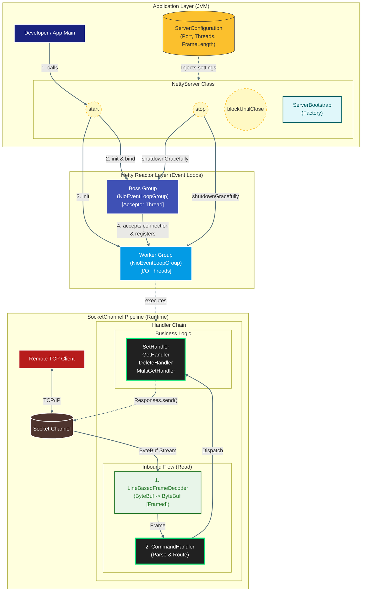
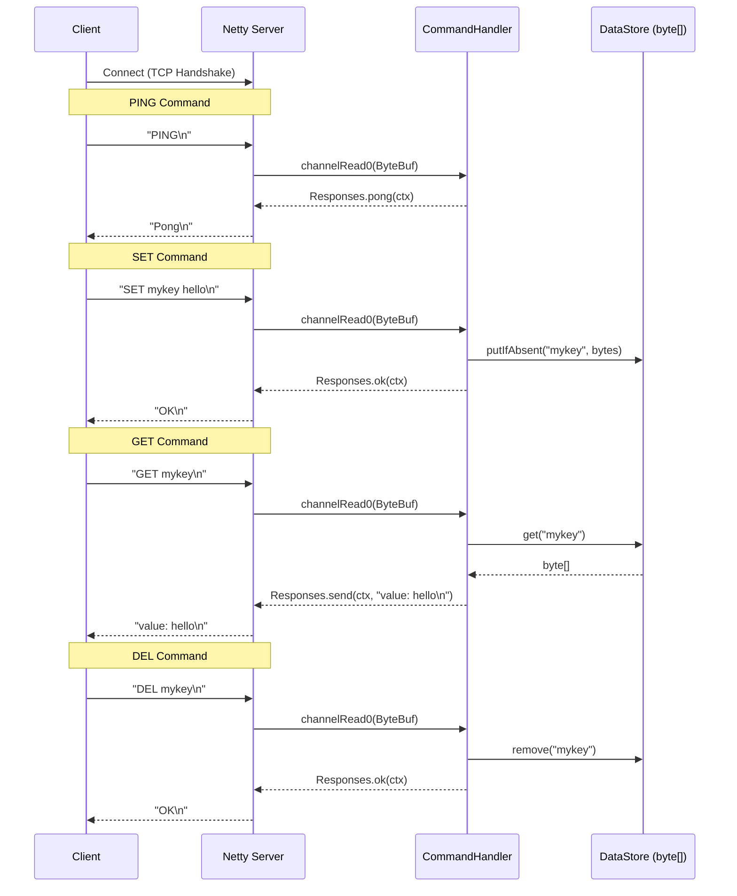

# SPiCa Server

SPiCa는 **Netty** 프레임워크를 사용하여 구현된 고성능 **In-Memory Key-Value Store Server**입니다. <br/>
클라이언트는 TCP를 통해 접속하여 `PING`, `SET`, `GET`, `DEL`, `MGET` 명령어를 사용할 수 있습니다.

## Features

*   **PING**: 서버 상태 확인 (`Pong` 응답)
*   **SET**: 키-값 저장 (`SET key value`)
*   **SET MATCH**: 조건부 저장 (`SET key newValue MATCH oldValue`)
*   **GET**: 키로 값 조회 (`GET key`)
*   **DEL**: 키 삭제 (`DEL key`)
*   **MGET**: 여러 키 동시 조회 (`MGET key1 key2 ...`)
*   **In-Memory Storage**: `ConcurrentHashMap`을 사용한 Thread-safe한 데이터 저장
*   **Memory Optimization**: `byte[]` 저장소와 ByteBuf 풀링으로 메모리 효율 극대화

## Performance

### Benchmark Results

| Command | Throughput | Latency (p50) | Latency (p99) |
|---------|------------|---------------|---------------|
| PING | 58,651 ops/sec | 0.063 ms | 0.144 ms |
| SET | 51,881 ops/sec | 0.073 ms | 0.154 ms |
| GET | 46,458 ops/sec | 0.074 ms | 0.211 ms |

*테스트 환경: 4 threads × 10,000 ops, JIT Warm-up 3회, TCP_NODELAY 적용*

### Optimization Techniques

*   **Memory Locality**: `String` 대신 `byte[]` 저장으로 61% 메모리 절감
*   **ByteBuf Pooling**: 상수 응답 재사용으로 Zero-Copy 전송
*   **Lazy Split**: 필요한 명령어에서만 문자열 분리 수행

## Architecture (Component Specifications)

### Thread Model (Event Loop Groups)
시스템의 스레드 모델은 역할에 따라 물리적으로 격리된 두 개의 `EventLoopGroup`으로 구성됩니다.

* **Acceptor Group (Boss):**
    * 단일 스레드(혹은 설정된 소수)로 구성되며 `OP_ACCEPT` 이벤트만을 전담합니다.
    * TCP 3-way Handshake를 완료한 `SocketChannel`을 생성하고, 즉시 Worker Group의 Selector에 등록(Register)하여 병목을 제거합니다.
* **I/O Processor Group (Worker):**
    * CPU 코어 수에 비례하여 할당된 스레드 풀입니다.
    * 할당된 Channel의 모든 `OP_READ`, `OP_WRITE` 이벤트를 **Single-Threaded Event Loop** 내에서 순차 처리하여, 불필요한 동기화(Lock) 비용을 제거합니다(Lock-free Architecture).

### Channel Pipeline (Responsibility Chain)
데이터 처리 로직은 **Interceptor Filter Pattern**의 변형인 `ChannelPipeline`을 통해 계층화되어 있습니다. 각 핸들러는 단일 책임 원칙(SRP)에 따라 엄격히 분리됩니다.

* **Protocol Adaptation Layer (Inbound):**
    * `LineBasedFrameDecoder`: TCP의 스트림(Stream) 특성으로 인한 Packet Fragmentation/Coalescing 문제를 해결하기 위해, Delimiter(\n) 기반으로 바이트 스트림을 온전한 프레임으로 재조립합니다.
* **Business Logic Layer:**
    * `CommandHandler`: 명령어를 파싱하고 적절한 핸들러로 라우팅합니다.
    * `SetHandler`, `GetHandler`, `DeleteHandler`, `MultiGetHandler`: 각 명령어별 비즈니스 로직을 수행합니다.
* **Response Layer:**
    * `Responses`: 상수 ByteBuf를 재사용하여 Zero-Copy 응답을 제공합니다.

### Virtual Threads (Planned)
Java 24의 Virtual Threads를 활용한 하이브리드 아키텍처를 계획 중입니다.

* **Fast Path**: PING, GET, SET, DEL 등 빠른 명령어는 Netty Event Loop에서 직접 처리
* **Slow Path**: SAVE, EVAL 등 블로킹 작업은 Virtual Thread에서 처리하여 다른 요청에 영향 없음

## Diagrams

### Server Structure 



### Sequence Diagram



## Data Flow Lifecycle

데이터의 흐름은 양방향(Duplex) 파이프라인을 통해 다음과 같은 상태 전이(State Transition)를 거칩니다.

1.  **Ingress (Connection & Read):**
    * Client Connection $\rightarrow$ Boss Group (Accept) $\rightarrow$ Worker Group (Registration).
    * Socket Read $\rightarrow$ **[Framing]** (Byte Stream assembly) $\rightarrow$ CommandHandler.
2.  **Processing (Execution):**
    * Decoded Command $\rightarrow$ Handler Routing $\rightarrow$ Business Logic Execution (e.g., `ConcurrentHashMap` Access).
3.  **Egress (Write & Flush):**
    * Execution Result $\rightarrow$ `Responses.send()` $\rightarrow$ ByteBuf (Pooled/Constant) $\rightarrow$ Socket Buffer Flush $\rightarrow$ Client.

## Project Structure

```
src/main/java/com/spica/
├── Application.java              # Entry Point
├── server/
│   ├── Server.java               # Server Interface
│   ├── ServerConfiguration.java  # Configuration (port, threads)
│   └── NettyServer.java          # Netty Bootstrap & Pipeline
└── handler/
    ├── Responses.java            # ByteBuf 상수 & 풀링 유틸리티
    ├── CommandHandler.java       # 명령어 파싱 & 라우팅
    ├── SetHandler.java           # SET 명령어 처리
    ├── GetHandler.java           # GET 명령어 처리
    ├── DeleteHandler.java        # DEL 명령어 처리
    ├── MultiGetHandler.java      # MGET 명령어 처리
    ├── PingPongHandler.java      # PING 명령어 처리
    └── SleepHandler.java         # SLEEP 명령어 처리 (테스트용)
```

## How to Run

### Prerequisites
- Java 24 or higher
- Gradle

### Run Server
```bash
./gradlew run
```
or
```bash
gradle run
```

### Client Test (netcat)

터미널을 열고 다음 명령어들을 입력하여 테스트할 수 있습니다.

**1. Ping Test**
```bash
echo "PING" | nc localhost 6379
# 응답: Pong
```

**2. Set Test**
```bash
echo "SET mykey myvalue" | nc localhost 6379
# 응답: OK
```

**3. Get Test**
```bash
echo "GET mykey" | nc localhost 6379
# 응답: value: myvalue
```

**4. Delete Test**
```bash
echo "DEL mykey" | nc localhost 6379
# 응답: OK
```

**5. Multi-Get Test**
```bash
echo "MGET key1 key2 key3" | nc localhost 6379
# 응답: 각 키별 결과
```

---

updatedAt: 2025.12.14
